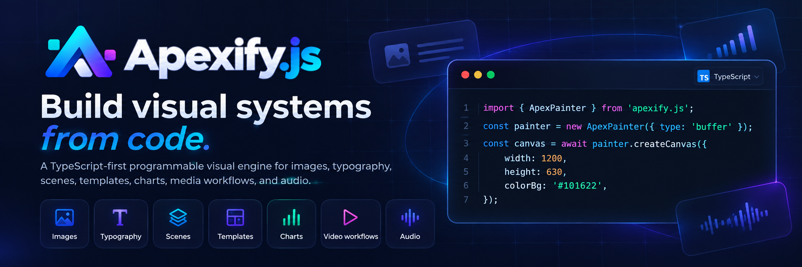

<p align="center">
  
</p>

# Apexify.js Documentation

This repository powers the Apexify.js documentation website and developer portal.

- **Website:** https://apexifyjs.vercel.app
- **Package repository:** https://github.com/EIAS79/Apexify.js
- **Documentation:** https://apexifyjs.vercel.app/docs/getting-started
- **API reference:** https://apexifyjs.vercel.app/api-reference
- **Gallery:** https://apexifyjs.vercel.app/gallery
- **Studio:** https://apexifyjs.vercel.app/studio

## Brand assets

The current brand assets live in `public/brand/`:

- `apexify-mark.png` — exact uploaded Apexify mark used for favicons and compact UI placements.
- `apexify-lockup.png` — exact uploaded Apexify.js horizontal logo/wordmark.
- `apexify-banner.png` — exact uploaded full repository/documentation banner.

The older SVG and AVIF files remain only as compatibility/fallback assets. The site and README use the original uploaded PNG artwork so the mark, wordmark geometry, and `.js` spacing stay exact.

## Development

```bash
npm install
npm run dev
```

For the complete documentation verification pipeline:

```bash
npm run verify
```

The site is built with Next.js and the documentation system is validated against the pinned Apexify.js package artifact.
