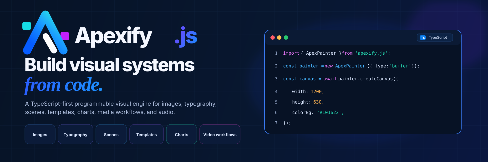

<p align="center">
  
</p>

# Apexify.js Documentation

This repository powers the Apexify.js documentation website and developer portal.

- **Website:** https://apexifyjs.vercel.app
- **Package repository:** https://github.com/EIAS79/Apexify.js
- **Documentation:** https://apexifyjs.vercel.app/docs/getting-started
- **API reference:** https://apexifyjs.vercel.app/api-reference
- **Gallery:** https://apexifyjs.vercel.app/gallery
- **Studio:** https://apexifyjs.vercel.app/studio

## Brand assets

The current brand assets live in `public/brand/`:

- `icon.svg` — compact Apexify mark used for the browser favicon and small UI placements.
- `banner-dark.svg` — full Apexify.js logo for dark surfaces.
- `banner-light.svg` — full Apexify.js logo for light surfaces.
- `readme-banner.svg` — repository/documentation banner.

The code shown in the README banner uses the same current `ApexPainter` / `createCanvas()` API shape used by the verified documentation homepage example.

## Development

```bash
npm install
npm run dev
```

For the complete documentation verification pipeline:

```bash
npm run verify
```

The site is built with Next.js and the documentation system is validated against the pinned Apexify.js package artifact.
